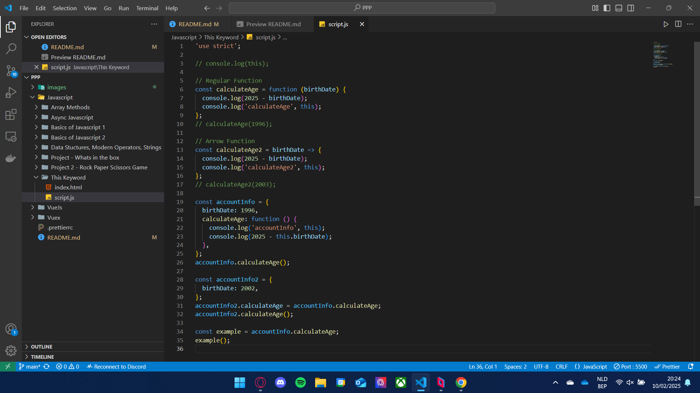
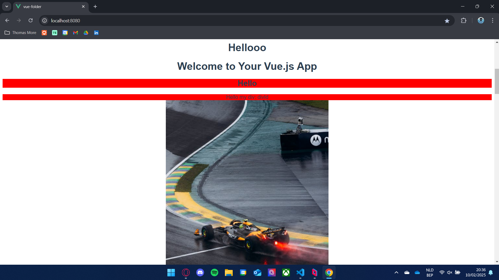
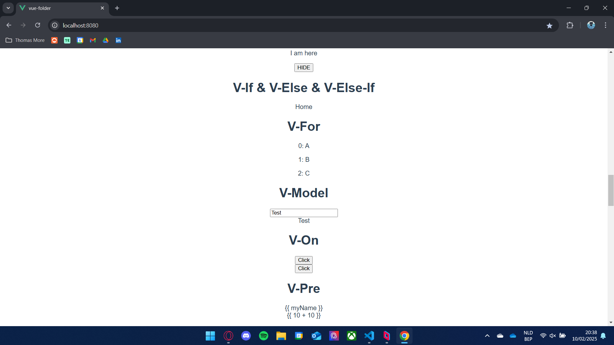
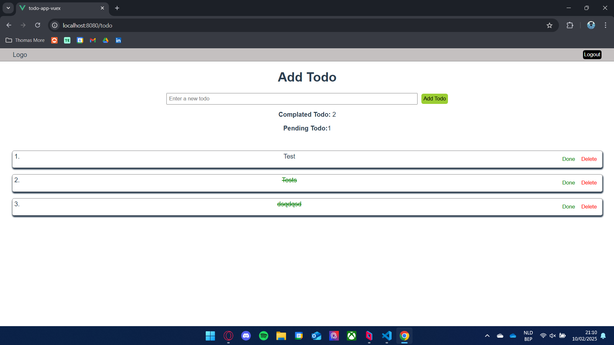
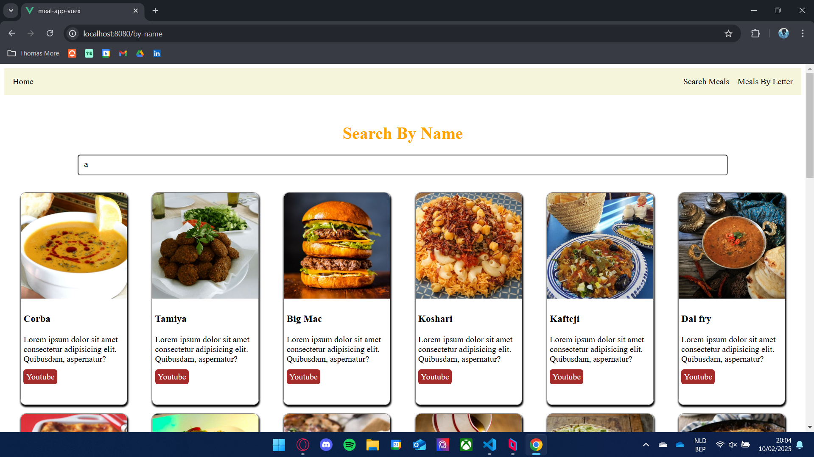

# Vue-Vuex-JavaScript

## Wat is Vue.js

Vue.js is een progressief JavaScript-framework voor het bouwen van interactieve gebruikersinterfaces en single-page applications (SPA's). Het is eenvoudig te integreren in bestaande projecten en biedt krachtige features zoals component-gebaseerde architectuur, reactiviteit en state management met Vuex.

Met Vue.js kun je:

- **Herbruikbare componenten** bouwen
- **Reactieve data-binding** gebruiken
- **Vuex** inzetten voor state management
- **Routing** beheren met Vue Router
- **Snelle en efficiënte webapps** ontwikkelen

**Officiële documentatie**: [Vue.js](https://vuejs.org/)

# Screenshots

## Section 2 - Basics of Javascript

## Section 3 - Basics of Javascript Part Two

## Section 4 - Javascript in the Browser: DOM and Events Fundamentals

## Section 5 - How JavaScript Works Behind the Scenes

## Section 6 - Data Structures, Modern Operators and Strings

## Section 7 - Arrays Methods

## Section 8 - Async Javascript

## Section 11 - Introduction to Vue.js

## Section 12 - Vue.js DOM Operations

## Section 13 - Vue.js Directives

## Section 14 - What Is This Data Object

## Section 15 - Style In Vue.js

## Section 16 - Lists & Conditional Statements

## Section 17 - Component Creation and Props

## Section 18 - Slot

## Section 19 - Dynamic Component

## Section 20 - Teleport

## Section 21 - Vue.js LifeCycles

## Section 22 - Refs & Computed & Watch

## Section 23 - Application_TodoApp

## Section 24 - Working with Form Elements

## Section 25 - Vuejs Async Component

## Section 26 - Mixin

## Section 27 - $nextTick

## Section 28 - HTTP Operations

## Section 29 - Application_NasaPhoto

## Section 30 - Routing

## Section 31 - Composition API

## Section 32 - Shopping-App

## Section 33 - State Management Vuex

## Section 34 - Todo-App-Vuex

## Section 35 - Meal-App-Vuex

